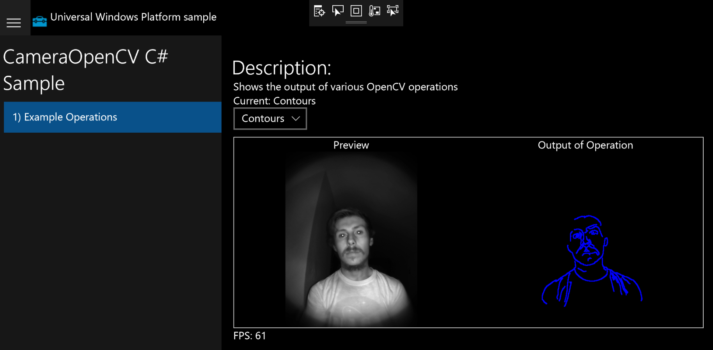

# OpenCV Surface Near Infrared Camera Example
A [Windows Universal Sample Application](https://github.com/microsoft/Windows-universal-samples) altered to use the Near Infrared Camera found on certain Surface and Windows Hello enabled devices 

A newer version of ths application exists that allows for simultaneous capture of both front Color and Infrared Cameras to a file.
Contact me at the email listed on my profile for access.
### Requirements
* Visual Studio 2017 Update 4 or higher
    * Along with the appropriate C# and C++ related libraries

### Running the Application
* Start Visual Studio and open the CameraFrames cs project located within the Samples directory using ```File > Open > Project/Solution.```
* Then build the project using  ```Ctrl+Shift+B```
* You can now open the CameraOpenCV project located within the Samples directory using ```File > Open > Project/Solution.```
* Then enter ```Ctrl+F5``` to build and run the program

### Application Screenshot  
In this case the subject was pictured in pitch black yet the application was still able to produce a clean image and derive contours from the image.  




### Build Issues
If you are getting build errors ensure that 
* The solution is configured for release and x64
* The minimum windows version is set to a value less than or equal to your devices windows version
